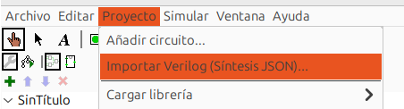
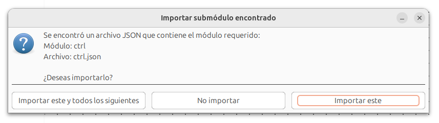
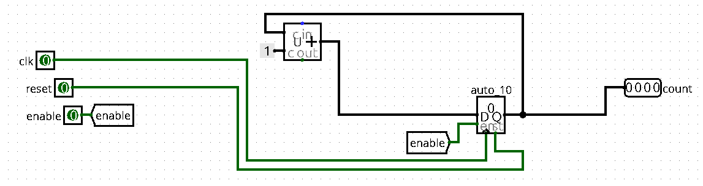

* [« Volver atrás](../../README.md)
* **Importador de `SystemVerilog`**

---

# Importador de `SystemVerilog`

El importador —o conversor de `SystemVerilog` a circuitos en formato `.circ`— es una herramienta que permite describir un 
circuito mediante diseño RTL en `SystemVerilog` y traducirlo automáticamente a un circuito compatible con `LogisimCL`. 
Esta traducción se apoya en un conjunto de componentes especializados y extensiones integradas en el simulador.

El objetivo principal de esta herramienta es facilitar el proceso de aprendizaje y experimentación en diseño digital, 
combinando lo mejor de ambos mundos: por un lado, el uso de un lenguaje estándar y ampliamente utilizado como `SystemVerilog`, 
y por otro, la capacidad de visualizar, simular y modificar el circuito generado dentro de la interfaz intuitiva de `LogisimCL`.

En esta sección se explica cómo utilizar el importador, acompañado de ejemplos prácticos que guiarán el proceso de conversión 
desde el código RTL hasta el circuito final.

## Requisitos previos

Para utilizar el importador, es necesario contar con **Yosys** instalado en tu máquina, ya que actúa como la puerta de 
entrada para la conversión de módulos escritos en `SystemVerilog`. El importador depende de Yosys tanto para verificar 
que el diseño sea **sintetizable** como para obtener una **representación intermedia** que permita traducir el circuito 
a un archivo `.circ` compatible con `LogisimCL`.

Puedes encontrar instrucciones de instalación y paquetes para diferentes plataformas en el siguiente enlace:  
👉 [https://yosyshq.net/yosys/download.html](https://yosyshq.net/yosys/download.html)

## Instrucciones
A continuación se señalarán los pasos a seguir para una correcta utilización de la herramienta de conversión. Para ello, se hará
uso del siguiente código escrito en `SystemVerilog` representando un contador de 4 bits, para una muestra más visual del proceso. Además, puedes encontrar otros
ejemplos para utilizar en el conversor en la carpeta [Tests/importer](../../Tests/importer), siguiendo las mismas instrucciones.
```
#counter.sv
module counter( input clk, reset, enable,
                output reg [3:0] count );
  always @(negedge clk)
    if (reset)
      count <= 0;
    else if (enable)
      count <= count + 4'd1;
endmodule
```

1. **Convertir el `sv` a `json`:**  
   Para este paso es importante considerar que tu código debe estar bien parametrizado; esto es, que el uso de valores constantes 
   tenga una referencia explícita respecto a la cantidad de bits a usar. Por ejemplo, en la línea `count <= count + 4'd1;`, si 
   no se enuncia el valor como `4'd1` y dejas a *Yosys* inferirlo, 
   probablemente el importador reportará errores respecto al ancho de entradas y salidas de algunos componentes.

   Una vez cuentes con tu `sv` bien escrito, puedes proceder a usar *Yosys* mediante el archivo `sv2json` disponible en el 
   directorio [scripts](../../scripts). Existen dos versiones: una en *Python* y otra en *Bash*; puedes usar la que 
   prefieras. Lo único necesario es especificar el archivo `.sv` de entrada y, opcionalmente, el nombre del archivo `.json` resultante.

    ```shell
    ./sv2json.sh counter.sv counter.json 
    ```
   Mediante este comando de ejemplo puedes convertir el archivo `sv` de forma rápida. Cabe destacar *YoSYS* permite hacer
    diversas conversiones de la forma más conveniente que estime el usuario mediante distintas combinaciones de comandos. Si
    quieres profundizar en este aspecto, te recomiendo visitar este repositorio:

   👉 [https://github.com/asinghani/open-eda-course/blob/main/yosys-tutorial/yosys-tutorial.md](https://github.com/asinghani/open-eda-course/blob/main/yosys-tutorial/yosys-tutorial.md)


2. **Entregar archivo al importador**: Una vez el archivo ha sido convertido, obtendrás algo parecido a esto en su interior:
   ```
   {
        "creator": "Yosys 0.33 (git sha1 2584903a060)",
        "modules": {
        "counter": {
        "attributes": {
        "cells_not_processed": "00000000000000000000000000000001",
        "src": "counter.sv:1.1-8.10"
        },
        "ports": ...
   ```
   Esa es la especificación de un circuito arrojado por *YoSYS*. Esta estructura, compleja en contenido pero simple de parsear
    es la que le sirve al importador para poder crear un circuito simulable.

    Para hacer uso del `json`, debes ir a la opción **Proyecto** del simulador, y presionar **Importar Verilog (Síntesis JSON)**. Se
    abrirá un cuadro de selección de archivo, donde deberás seleccionar el `json` que deseas importar a `LogisimCL`.

    


3. **Selecciona tus opciones adicionales**: Usualmente, el proceso de importar es tan sencillo como realizar los pasos 1 y 2. Sin
    embargo, puede ocurrir que el sistema te consulte sobre archivos adicionales a importar si es que tu `sv` depende de otros módulos.
    Para este caso, simplemente se te preguntará si quieres usar o no determinado archivo, o bien que seleccione el primero que encuentre
    en su defecto. Puedes seleccionar lo que te parezca más prudente, sólo asegúrate que el circuito que importarás tenga lógica con
    lo que esperas que cumpla el circuito final.

    


4. **¡Y listo!**: Ocurriese o no lo anterior, ya estás listo con la conversión. Se te preguntará mediante un cuadro de diálogo si
quieres ir al circuito que importaste o quedarte en el circuito actual. Sea la opción que escojas, el circuito ya está disponible
para tus necesidades, por lo que no es necesario que hagas nada más respecto al importador. Puedes proceder a usar el circuito o a
modificarlo según lo requieras. A continuación está el resultado de la conversión de `counter.sv`, el circuito que te mostré arriba.

    

El sistema es increiblemente sencillo en apariencia, guardando una complejidad invisible al usuario que permite desde la síntesis de circuitos
sencillos hasta los más complejos y enrevesados posibles (obviamente bajo los parámetros educativos que se consideraron para el diseño 
de esta herramienta).

Por último, a disposición de los usuarios, en el mismo directorio [Tests/importer](../../Tests/importer) puedes encontrar varios
de los circuitos utilizados para probar las capacidades del conversor. Si ves que alguno de los circuitos que importaste difiere
de los que se encuentran en dicha carpeta, no te preocupes. El sistema de disposición de componentes toma decisiones por cada
circuito importado de forma independiente, por lo que es normal que difieran entre unos y otros. Lo importante es que conserve
claridad y que los componentes se conecten de forma lógica y directa en la medida de lo posible.


